# Hospital Information System

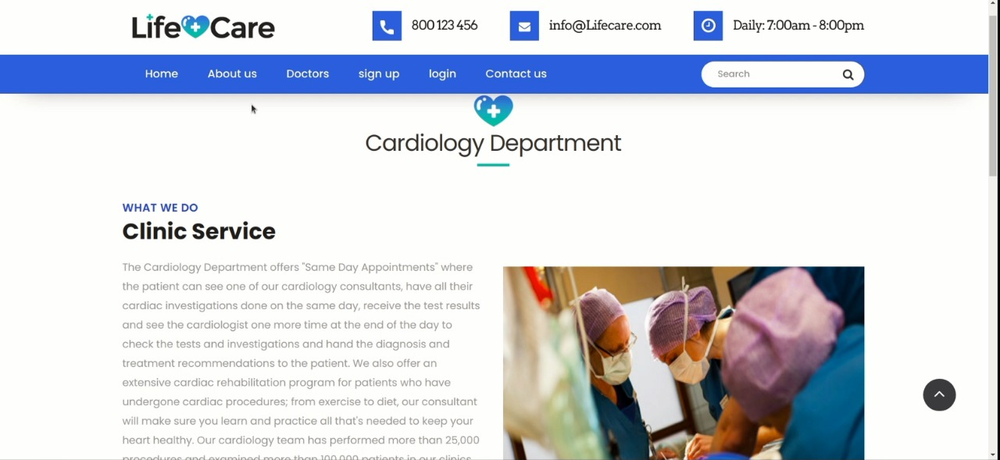

## *About the system*

- different users can use the application and each category can do different stuff (eg. Doctors, Patients, Admin, ..etc)
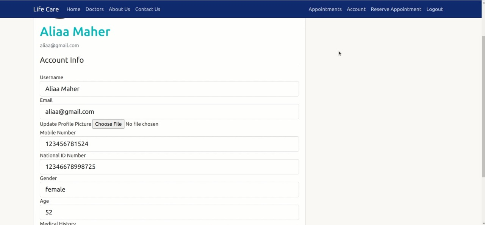
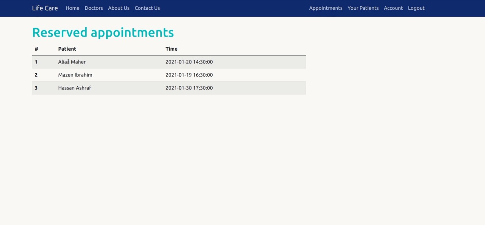


- The application uses static files, file uploads (eg. patients scans)
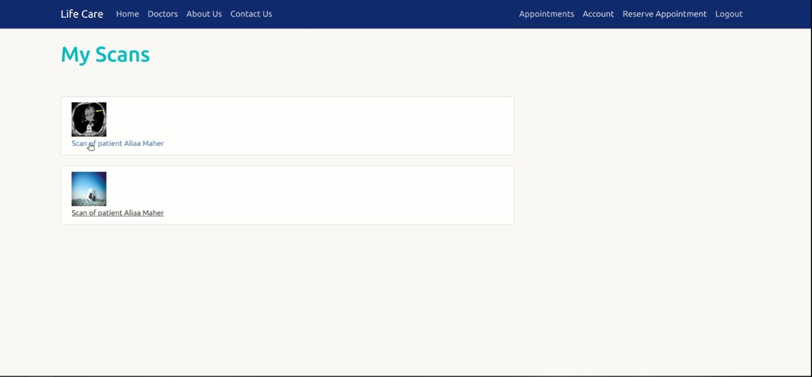


- user sign up and sign in forms
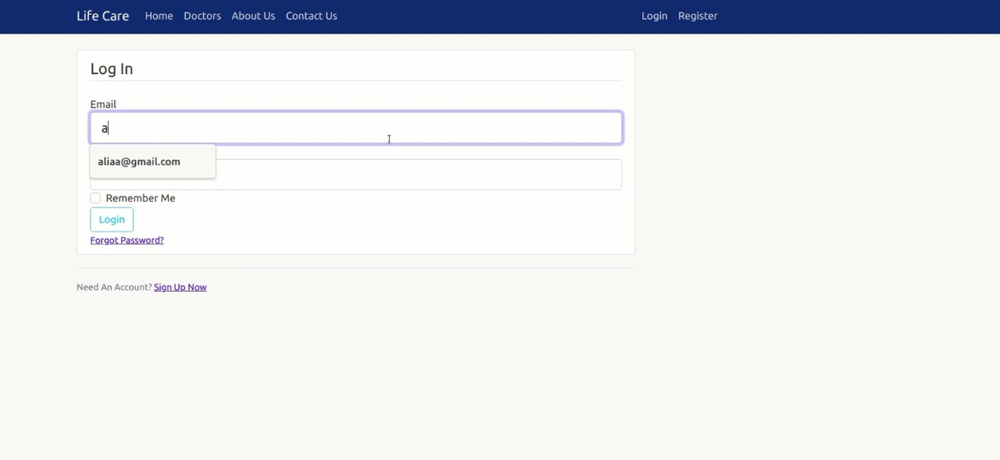
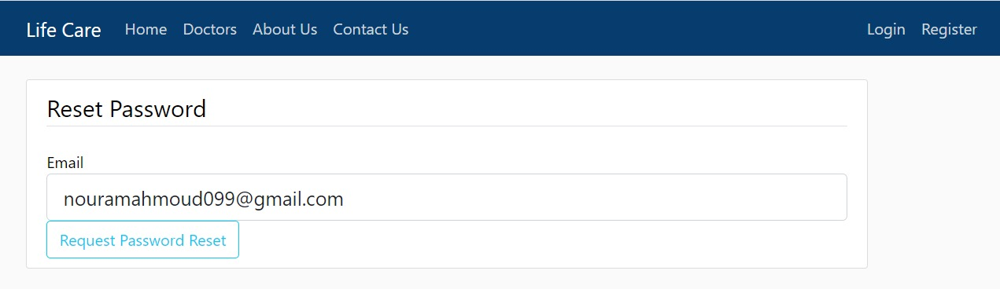

-  Synchronize the application with google calender or any calender for doctors.
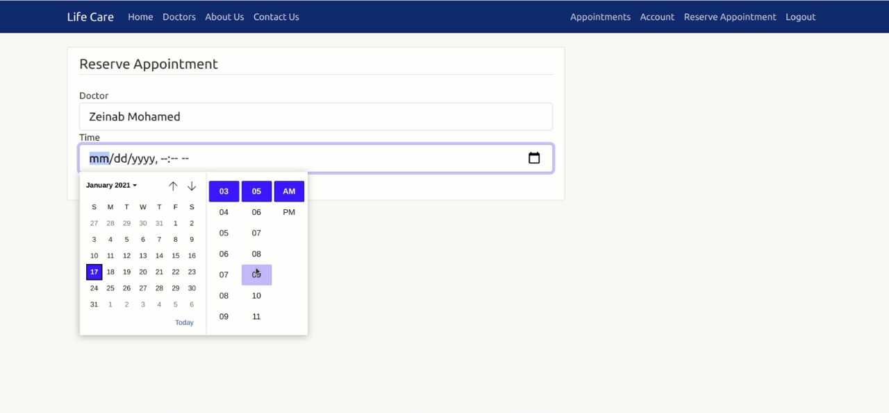


- contact us forms for any complains or special request
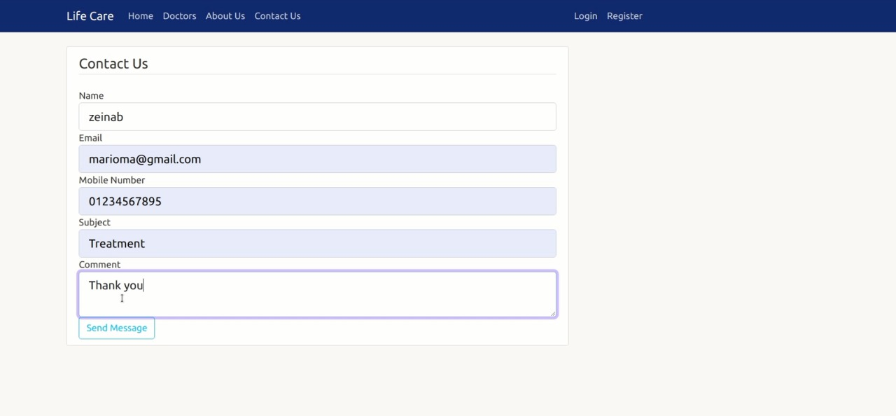
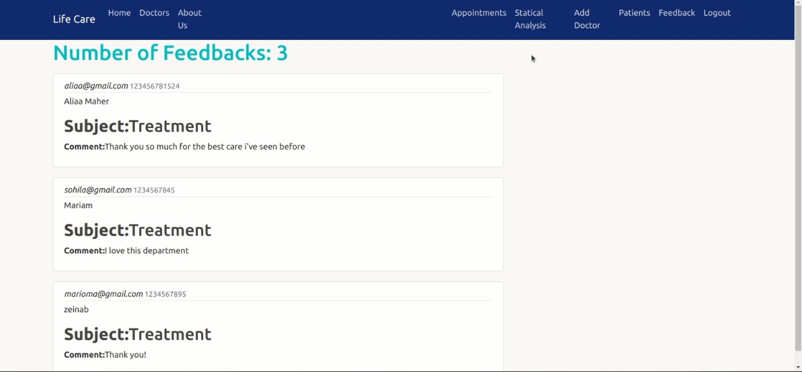


-  statistical analysis for the admin entry
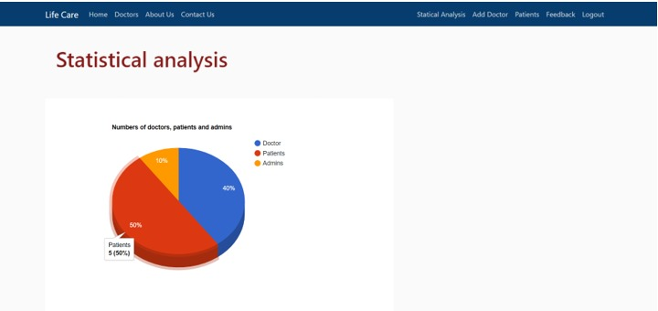
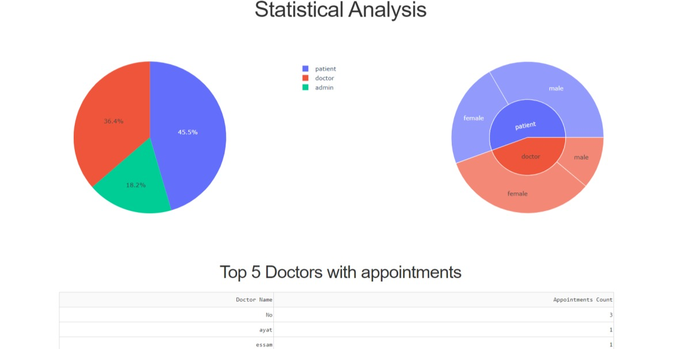


### PIP Dependencies

- Install dependencies by naviging to the project directory and running:
  ```
    pip install -r requirements.txt
  ```
  This will install all of the required packages we selected within the requirements.txt file.


***

It was a team project done by: 
[Mariam Ashraf](https://github.com/mariamashraf731),
[Marwa Abdelaal](https://github.com/MarwaAbdelAal),  
[Nada Ezzat](https://github.com/nadaezzat-99), 
[Noura Mahmoud](https://github.com/Noura-Mahmoud)  
